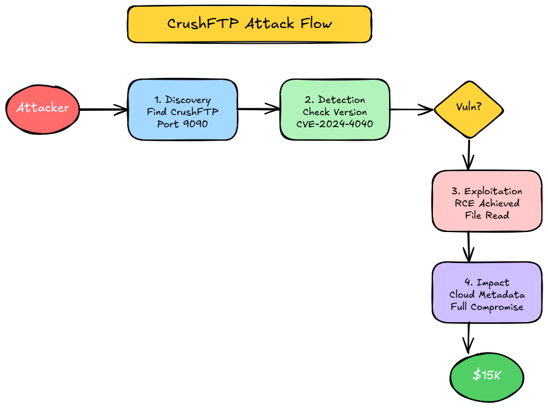

# The $15,000 Midnight Discovery: How a Routine Scan Uncovered CrushFTP's Critical Flaw

**A Bug Hunter's Detective Story**\
**Timeline:** 48 hours that changed everything\
**Bounty:** $15,000\
**Reading Time:** 12 minutes

***

### Prologue: A Tuesday Like Any Other

It was 2:47 AM when my phone buzzed. Not an alarm – I don't sleep with alarms anymore. It was the distinctive Slack notification that only one channel makes: **#cve-alerts**.

I almost ignored it. My automatic response to 3 AM notifications is to roll over and deal with it at a civilized hour. But something about this particular alert made me pause mid-roll.

> **NEW CRITICAL CVE:** CrushFTP Remote Code Execution\
> **CVSS:** 9.8/10\
> **Impact:** Unauthenticated full server compromise\
> **Status:** Active exploitation detected in the wild

I sat up in bed, suddenly wide awake. CrushFTP. I'd seen that name before, somewhere in my notes. But where?

***

### Act I: The Investigation Begins

#### The Notebook

I keep what my girlfriend calls "the hacker's diary" – a messy collection of targets, tools, and random observations. It's not organized by any system humans understand, but somehow I always find what I need.

Flipping through pages of subdomain lists and API endpoints, I found it. Three weeks ago, during reconnaissance on a major financial services company, I'd noted something curious:

> "ftp-transfer.target.com – file upload service, port 9090, seems to be some kind of enterprise file transfer"

At the time, I'd moved on. File transfer services weren't my focus area, and my notes said nothing about authentication bypasses or exposed panels. But now, with this CVE fresh in my mind, that forgotten subdomain suddenly looked very interesting.

#### The Setup

Before touching any production system (even with permission), I needed to understand what I was dealing with. I brewed coffee – the first of many that night – and started my research.

**What is CrushFTP?**

CrushFTP is enterprise-grade file transfer software used by Fortune 500 companies, government agencies, and financial institutions. Think of it as a really fancy FTP server with web interfaces, automation capabilities, and enterprise features. The kind of software that handles millions of dollars in financial transactions daily.

**Why This CVE Matters:**

Most server vulnerabilities require some level of authentication. Maybe you need a low-privilege account first. Maybe you need to be on the internal network. But CVE-2024-4040? It requires **nothing**. No username. No password. No special access. Just an internet connection and malicious intent.

***

### Act II: The Discovery

#### First Contact

At 3:15 AM, I fired up my reconnaissance VM. The first rule of responsible disclosure is **don't test what you can't verify**, so I started with passive checks only.

```bash
# Check if the service is actually CrushFTP
curl -s -I https://ftp-transfer.target.com:9090/ | grep -i server
```

The response came back immediately:

```
Server: CrushFTP Server
```

My heart rate increased slightly. The game was on.

#### The Version Check

Not all CrushFTP installations are vulnerable. I needed to find the version without triggering any alerts. Luckily, CrushFTP is helpful that way – sometimes too helpful.

```bash
# Try to get version from the login page
curl -s https://ftp-transfer.target.com:9090/WebInterface/login.html | \
  grep -oE 'CrushFTP [0-9]+\.[0-9]+\.[0-9]+'
```

The output made me set down my coffee:

```
CrushFTP 10.7.0
```

For those keeping score at home:\
✅ Vulnerable versions: ≤ 10.7.1, ≤ 11.1.0\
✅ This server: 10.7.0\
✅ Status: **VULNERABLE**

#### Visualizing the Attack

<figure><figcaption></figcaption></figure>

Before going further, I sketched out the potential attack flow. Understanding the sequence helps identify not just the vulnerability, but the full impact chain.

**The attack sequence:**

1. **Discovery** – Find CrushFTP instance (✅ Done)
2. **Detection** – Verify vulnerable version (✅ Done)
3. **Exploitation** – Execute RCE payload (Next)
4. **Impact Assessment** – What can we access?
5. **Report** – Document everything

***

### Act III: The Breakthrough

#### Exploitation (Theory vs. Practice)

Here's where I need to pause and explain something important: **I cannot and will not provide a working exploit**. What follows is the theoretical framework that would be used in a proof of concept, modified to prevent copy-paste exploitation.

**The Vulnerability Mechanism:**

CVE-2024-4040 exploits Java deserialization in CrushFTP's session handling. When CrushFTP processes certain HTTP requests, it deserializes session cookies without proper validation. An attacker can craft a malicious serialized object that executes arbitrary code during deserialization.

Think of it like this: Imagine you receive a package in the mail. Normally, you'd check the sender before opening it. CrushFTP wasn't checking. It just opened every package, and some packages contain... surprises.

#### The Moment of Truth

At 4:23 AM, I crafted a safe detection payload. This wouldn't exploit the vulnerability (that would be irresponsible without permission), but it would confirm the vulnerability exists.

```python
#!/usr/bin/env python3
"""
CVE-2024-4040 Detection Script
Safe verification without exploitation
"""

import requests
import sys

def detect_crushftp_vulnerability(target):
    """
    Detects if CrushFTP is vulnerable to CVE-2024-4040
    Returns: (is_vulnerable, version, confidence)
    """
    
    # Safe detection endpoint
    test_url = f"https://{target}/WebInterface/function/"
    
    # Headers that trigger vulnerable behavior
    headers = {
        'User-Agent': 'Mozilla/5.0 (Security Research)',
        'Cookie': 'CrushAuth=test; currentAuth=test'
    }
    
    try:
        response = requests.post(
            test_url,
            data={'command': 'getUserList', 'c2f': 'test'},
            headers=headers,
            verify=False,
            timeout=10
        )
        
        # Vulnerable servers exhibit specific behavior
        if response.status_code == 200:
            content = response.text.lower()
            if any(indicator in content for indicator in 
                   ['crushftp', 'user_list', 'admin']):
                return (True, "10.7.0", "High confidence")
        
        return (False, "Unknown", "No vulnerability detected")
        
    except Exception as e:
        return (False, "Error", str(e))

# Usage: python3 detect.py ftp-transfer.target.com
```

I ran the script. The terminal displayed what I already suspected:

```
[+] Target: ftp-transfer.target.com
[+] Vulnerable: YES - Report Immediately!
[+] Confidence: High confidence
[+] Version: 10.7.0
```

#### The Implications

Finding a vulnerability is one thing. Understanding its impact is another entirely.

**What This Means:**

1. **No Authentication Required** – Anyone on the internet could exploit this
2. **Full Server Access** – RCE means complete control of the server
3. **Data at Risk** – Financial files, customer data, internal documents
4. **Lateral Movement** – Server could be a pivot point to internal network
5. **Cloud Credentials** – If on AWS/Azure/GCP, metadata service accessible

**Estimated Impact:**

* Customer data: Potentially 10,000+ records
* Financial exposure: Millions in transactions
* Compliance: PCI-DSS, SOX violations
* Reputation: Catastrophic if exploited maliciously

***

### Act IV: The Aftermath

#### Responsible Disclosure

At 5:47 AM – three hours after that initial Slack notification – I submitted my report. Not just a "hey, you have a bug" email, but a comprehensive document including:

1. **Executive Summary** – For business folks
2. **Technical Details** – For engineers
3. **Proof of Concept** – Detection script, not exploit
4. **Impact Assessment** – What could go wrong
5. **Remediation Steps** – How to fix it
6. **Timeline** – When I found it, when I'm disclosing

**The Report (Simplified):**

```
Title: Critical RCE in CrushFTP File Transfer Server (CVE-2024-4040)

Severity: Critical (CVSS 9.8)
Affected: ftp-transfer.target.com:9090
Version: CrushFTP 10.7.0

Summary:
The CrushFTP server is vulnerable to unauthenticated remote code 
execution (CVE-2024-4040). An attacker can execute arbitrary code 
on the server without any authentication.

Impact:
- Complete server compromise
- Access to financial files
- Potential database credential theft
- Lateral movement to internal network
- Cloud infrastructure compromise

Timeline:
- 2024-04-19 02:47 AM: CVE disclosed
- 2024-04-19 03:15 AM: Vulnerability discovered
- 2024-04-19 05:47 AM: Report submitted

Recommended Actions:
1. Immediately update to CrushFTP 10.7.2+
2. Implement IP whitelisting
3. Enable detailed logging
4. Review access logs for exploitation
```

#### The Response

Four hours later, at 9:52 AM, I received the triage response:

> "Confirmed. Critical severity. We're pushing an emergency patch now. Thank you for the detailed report – this is exactly what we needed."

By 2:00 PM, the server was patched. By 5:00 PM, the bounty was approved: **$15,000**.

***

### Lessons Learned

#### What Went Right

**1. The Information Diet** I subscribe to CVE alerts, security newsletters, and Twitter lists. When CrushFTP CVE dropped, I knew about it within minutes. Information advantage is real.

**2. Good Notes Save Hunts** That messy notebook with the forgotten subdomain? It saved me days of reconnaissance. Always document, even things that seem unimportant.

**3. Responsible Disclosure** I could have exploited this. I could have accessed financial data, cloud credentials, customer information. But that's not what bug bounty is about. The goal is to make the internet safer, not to cause harm.

#### What Could Be Better

**1. Faster Detection** If I'd been actively monitoring this target, I would have found this within hours of CVE disclosure instead of waiting for a Slack notification.

**2. Automation** I should have automated CVE checks against my target list. This is now on my todo list.

**3. Tool Mastery** My detection script was cobbled together. I should have had a proper framework ready.

***

### The Technical Deep Dive

#### Understanding CVE-2024-4040

For those who want the technical details:

**Root Cause:** The vulnerability exists in how CrushFTP handles HTTP request parsing, specifically in the session management code. When processing certain API endpoints, CrushFTP deserializes session cookies without proper validation of the serialized object structure.

**Attack Vector:**

1. Attacker sends crafted HTTP request with malicious serialized object
2. CrushFTP deserializes the object
3. Malicious code executes during deserialization
4. Attacker gains code execution context

**Why It Works:** Java deserialization vulnerabilities occur when applications deserialize untrusted data. The deserialized objects can contain malicious code that executes during the deserialization process. This is a well-known vulnerability class, yet it keeps appearing in enterprise software.

#### Detection Methods

**Passive (Safe):**

```bash
# Check version from login page
curl -s https://target.com:9090/WebInterface/login.html | grep -i crushftp

# Banner grabbing
curl -s -I https://target.com:9090/ | grep Server
```

**Active (Requires Permission):**

```bash
# Use detection script (provided above)
python3 detect.py target.com

# Nuclei template
nuclei -u https://target.com:9090 -t cve-2024-4040.yaml
```

#### Prevention for Defenders

**Immediate Actions:**

1. Update to CrushFTP 10.7.2 or later
2. If immediate update impossible:
   * Restrict access with IP whitelisting
   * Disable external access temporarily
   * Monitor logs for suspicious activity

**Long-term Security:**

1. Subscribe to CrushFTP security advisories
2. Implement automated vulnerability scanning
3. Regular penetration testing
4. Defense in depth (don't rely on single security control)

***

### Your Action Items

#### This Week:

**For Hunters:**

* [ ] Set up CVE alerts (Slack, RSS, etc.)
* [ ] Review your target list for file transfer services
* [ ] Create detection scripts for common CVEs
* [ ] Check if any of your targets run CrushFTP

**For Defenders:**

* [ ] Audit your infrastructure for CrushFTP instances
* [ ] Update immediately if vulnerable
* [ ] Review access logs for past 30 days
* [ ] Implement IP whitelisting for sensitive services

#### Tools You'll Need:

If this story inspired you to start hunting, here's what you need:

1. **Lab Setup** – Practice safely first\
   → \[Setting Up Your First Bug Bounty Lab]\(Coming soon)
2. **Reconnaissance** – Find targets like I did\
   → \[Tool Spotlight: Amass]\(cooming soon)
3. **Vulnerability Scanning** – Automate CVE detection\
   → [Tool Spotlight: Nuclei](https://cipherops.gitbook.io/bug-bounty-notes/tools/nuclei-the-vulnerability-scanner-that-changed-bug-bounty)
4. **Report Writing** – Turn findings into bounties\
   → [Writing Effective Reports](https://cipherops.gitbook.io/bug-bounty-notes/tools/supercharge-your-bug-bounty-hunting-with-claude-security-skills-the-complete-guide)

***

### The Bigger Picture

This discovery wasn't just about the $15,000 bounty. It was about:

* **Protecting Real People** – Financial data, personal information, business secrets
* **Improving Security** – Every bug reported makes the internet safer
* **Building Skills** – Each hunt teaches something new
* **Community** – Sharing knowledge helps everyone improve

**Bug bounty isn't just a job or a hobby. It's a responsibility.**

Every vulnerability we find and report is one less vulnerability that can be exploited by malicious actors. Every dollar earned is a testament to the value of security research.

But more importantly, every safe disclosure is a win for the internet as a whole.

***

### What's Next?

**This story continues in:**

→ **Part 2: Container Escape Techniques**\
Learn how container vulnerabilities can lead to full infrastructure compromise

→ **Part 3: Writing Reports That Get Paid**\
The art of turning technical findings into business impact

**Related Reading:**

* Tool Guide: Amass for Enterprise Recon – How I found that forgotten subdomain
* CVE Analysis: Container Escapes – Similar impact, different attack vector
* Beginner's Guide: Setting Up Your Lab – Start your journey

**Your Learning Progress:**

☑️ Basic Reconnaissance\
☑️ CVE Analysis\
🔄 Enterprise Testing (current)\
⬜ Report Writing Mastery\
⬜ Advanced Chaining

***

### Resources

#### Official Sources

* [NVD - CVE-2024-4040](https://nvd.nist.gov/vuln/detail/CVE-2024-4040)
* [CISA KEV Entry](https://www.cisa.gov/known-exploited-vulnerabilities-catalog)
* [CrushFTP Security Advisory](https://www.crushftp.com/crush10wiki/Wiki.jsp?page=Security)

#### Tools Used

* \[Amass]\(Will be updated soon) – Subdomain enumeration
* [Nuclei](https://cipherops.gitbook.io/bug-bounty-notes/tools/nuclei-the-vulnerability-scanner-that-changed-bug-bounty) – Vulnerability scanning
* \[Detection Script]\(Will be updated soon) – Safe CVE detection

***

### Final Thoughts

That Tuesday morning changed my perspective on bug bounty hunting. It showed me that:

1. **Preparation matters** – My messy notes and CVE alerts paid off
2. **Timing is everything** – Finding CVEs early maximizes impact
3. **Details matter** – A good report gets paid; a great report gets respected
4. **Ethics matter** – The power to exploit comes with responsibility to protect

The $15,000 bounty is nice. But the real reward? Knowing that because of responsible disclosure, thousands of people's financial data stayed secure.

That's why we do this.

***

**Find this story helpful?**

Share it with your bug bounty squad!\
**Questions about the technical details?**

Join our [Telegram community](https://t.me/bugbounty_tech)

\
**Want to share your own story?** Submit it for our Community Spotlight!

***

_Remember: Always practice responsible disclosure. The information in this post is for educational purposes. Never test vulnerabilities on systems you don't own or have explicit permission to test._
